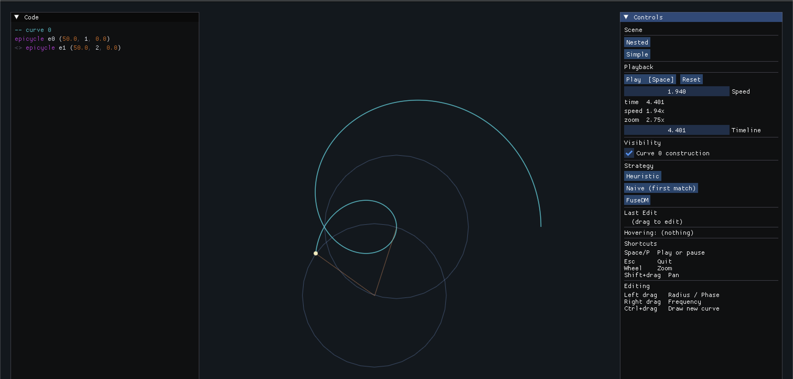

# Epicycles - A Bidirectional DSL for geometric creative coding



this the main repo of my masters project! i do not have the willpower to write a full readme, but if you'd like to find out more about it, you can look at the [slides](./slides/main.pdf) or the [thesis](./writing/DissertationTemplate.pdf) which explain the design in various detail 

## Building

```bash
nix develop
cabal build
```

## Running

```bash
cabal run exe:vector-dsl
```

## Testing

```bash
cabal test
```

Lean proofs are contained in the `proofs` directory